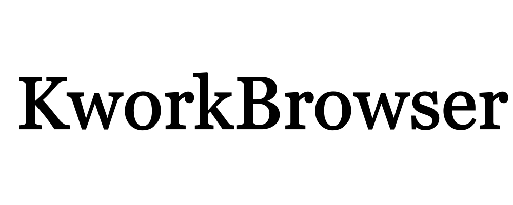

<h1 align ="center">KworkBrowser</h1>

---------------------------------

-------------------------------

<h2 align ="center">Задача приложения</h2>

1. Удобный мониторинг тасков
    * Выводить интересующие темы с минимальной информацией о тасках 
    * Помечать таски цветами
    * Показать подробную информацию о таске
    * Показать подробную информацию о заказчике
2. Анализ тасков
    * Дополнить Задачи

[Ссылка на сайт](https://kwork.ru/)
